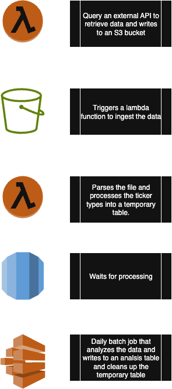

# OptionMetrics coding assignment

## Thoughts about the overall design of the solution:
Ideally, in production the incoming data would come in via a streaming service like AWS Kinesis or Kafka, and the data 
ingestion module would be a consumer of that stream. However, for the sake of this assignment, we are assuming that the 
data magically shows up in a staging area.

In the event the data is polled once per day via some data retrieval API, lambda functions could be triggered to start 
the data ingestion module at the appropriate time. The data ingestion module would then be responsible for extracting 
the data from an S3 bucket, transforming it into a structured format, and loading it into the appropriate storage 
location. In my example, I have assumed a temporary staging table in a database, but this could be replaced with any 
storage solution.

### Possible process flow

